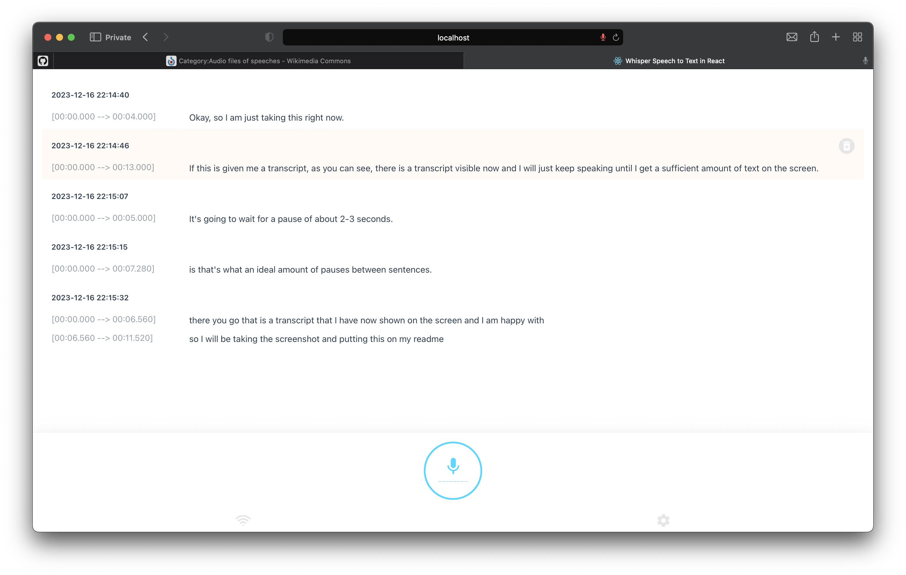
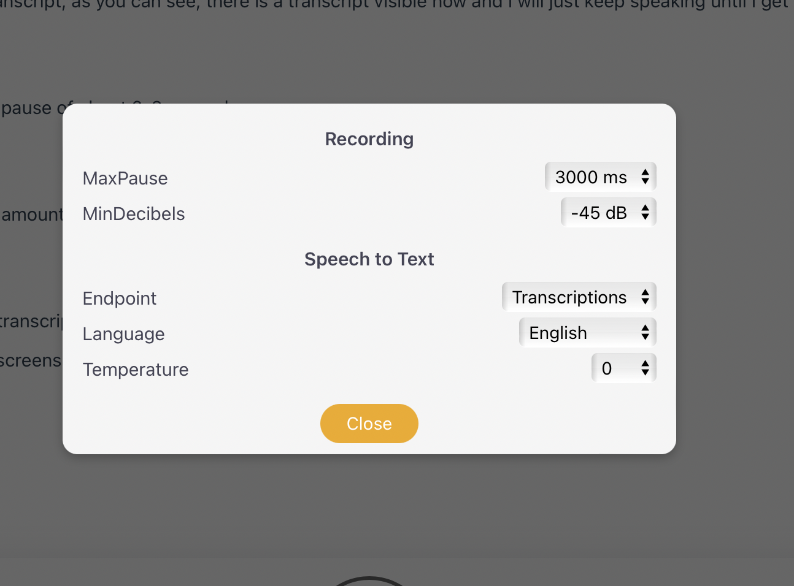

# Usage



**Please note that you can choose to use either the `whisper python module` which does not need OpenAI API Key or `whisper API` which needs a working `OpenAI API Key` to run this application.**

Run the app and click the Start button.

Recording will only start if voice or sound is detected. You can control the detection sensitivity by adjusting the [minDecibels](https://developer.mozilla.org/en-US/docs/Web/API/AnalyserNode/minDecibels) value. Lower value means more soft sounds are detected. Note that the values are in negatives.

If sound is not detected for 3 seconds, recording will stop and the audio data is sent to the backend for transcribing. In normal speech, it is said that the people tend to pause, on average, [around 2 seconds between sentences](https://mannerofspeaking.org/2019/11/12/pauses-in-a-speech-why-when-and-how/). You can also control the maximum time to wait for pause by adjusting the `maxPause` value.



If the audio data does not contain any text data, it will be disregarded.

The transcription data will be saved in the localStorage for easy retrieval.
You can verify the accuracy of the transcription/translation by playing the saved audio data associated with the transcription/translation.


It is possible to delete the transcription item. Hover on a transcription to show the delete button and press the icon to show a dialog box to confirm.

- If you set `minDecibels` to very low values (-60dB to -70dB), recording can be triggered by faint noises and the resulting audio data may not be discernible to the API and it can throw 400 Bad Request.

**App settings**

- MaxPause: 2500ms
- MinDecibels: -60dB
- Transcriptions
- Language: English
- Temperature: 0

MaxPause setting will cause the transcription to be divided into 3 files.

Audio data is saved as webm.

**Result**

1st part
- File size: 693KB
- Duration: 01:03
- Process time: 4s

2nd part
- File size: 808KB
- Duration: 01:00
- Process time: 4s

3rd part
- File size: 462KB
- Duration: 00:29
- Process time: 2s

`Process time` is the time from sending the audio data to the back end and finally getting result from whisper API.

# Speech To Text

I just replaced the API call using [OpenAI Node.js library](https://platform.openai.com/docs/api-reference/audio) from previously using `axios` to simplify everything.

```javascript
export async function whisper({
    mode = 'transcriptions',
    file,
    model = 'whisper-1',
    prompt = '',
    response_format = 'json',
    temperature = 0,
    language = 'en',
}) {

    const options = {
        file,
        model,
        prompt,
        response_format,
        temperature,
        language,
    }

    try {

        const response = mode === 'translations' ? await openai.audio.translations.create(options) : await openai.audio.transcriptions.create(options)
        
        return response

    } catch(error) {
        
        console.log(error.name, error.message)

        throw error
        
    }

}
```

I will be using this in the POST handler for the route, as shown below.

```javascript
try {

  const result = await whisper({
    file: fs.createReadStream(filepath),
    response_format: 'vtt',
    temperature: options.temperature, // e.g. 0, 0.7
    language: options.language, // e.g. en, ja
  })

  return new Response(JSON.stringify({ 
      data: result?.data,
  }), {
      status: 200,
  })
  
} catch(error) {

  console.log(error)

}
```

For this project, I need the `timestamp` of the transcription so I am using `response_format` as `vtt` file. If you use `text` file, the output will not contain any timestamp.

# Credit
Heavy inspiration from supershaneski's openai-whisper-api

# Installing Whisper Python module

If you wish to use this app without OpenAI API key or without using whisper API endpoint, you need to install this.

First, you need to install [`Whisper`](https://github.com/openai/whisper) and its `Python` dependencies

```sh
$ pip3 install git+https://github.com/openai/whisper.git
```

You also need `ffmpeg` installed on your system

```sh
$ brew install ffmpeg
```

By this time, you can test `Whisper` using command line

```sh
$ whisper myaudiofile.ogg --language English --task translate
```

You can find sample audio files for testing from [here](https://commons.wikimedia.org/wiki/Category:Audio_files_of_speeches).


If that is successful, continue to the installation procedures below.


# Installation

**Important:** Be sure to [install ***ffmpeg***](#using-ffmpeg-to-trim-audio-file) in your system before running this app. See previous section.

Clone the repository and install the dependencies

```sh
git clone https://github.com/himnish/whisper_react project

cd project

npm install
```

Create a `.env` file in the root directory and copy the contents of `.env.example` and replace the value of `OPENAI_APIKEY` with your own.

```sh
OPENAI_APIKEY=PUT_YOUR_OPENAI_API_KEY
DO_NOT_USE_API=false
```

If you do not want to use `Whisper API`, just set `DO_NOT_USE_API` to TRUE. Be sure to [install the python module](#installing-whisper-python-module) first.

```sh
OPENAI_APIKEY=PUT_YOUR_OPENAI_API_KEY
DO_NOT_USE_API=true
```

Finally, to run the app

```sh
npm run dev
```

Open your browser to `http://localhost:3005/` to load the application page.
Please note that the `port number` is subject to the availability and may change.

> Note: You can only capture audio data using `http` in `localhost`.
